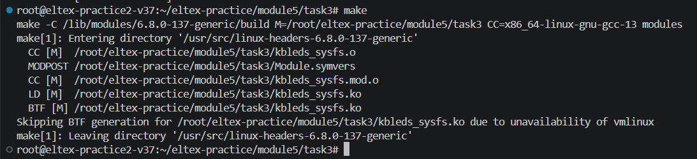
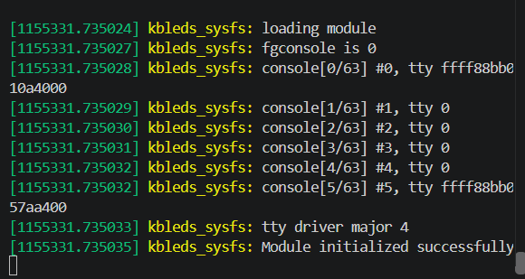
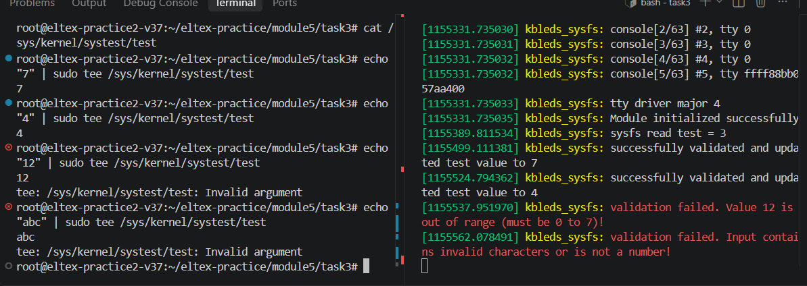

Царенкова В. А. АВТ-342

Модуль 5

Практика 3

make

dmesg -w

{width="6.496527777777778in"
height="1.4916666666666667in"}

Рисунок 1 -- Компиляция модуля

insmod kbleds_sysfs.ko

{width="6.042509842519685in"
height="3.2191994750656168in"}

Рисунок 2 -- Загрузка модуля

cat /sys/kernel/systest/test

echo \"7\" \| sudo tee /sys/kernel/systest/test

{width="6.496527777777778in"
height="2.308333333333333in"}

Рисунок 3 -- Проверка работы

rmmod kbleds_sysfs

make clean
