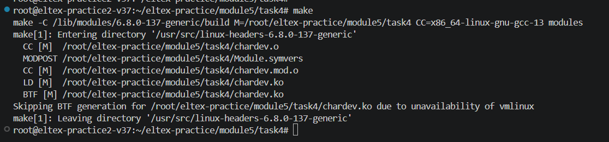
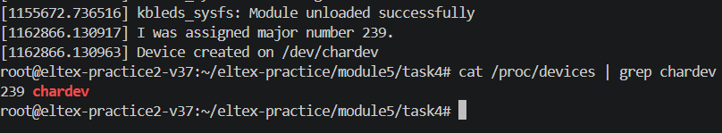
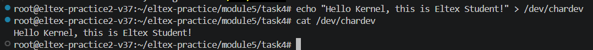

Царенкова В. А. АВТ-342

Модуль 5

Практика 4

make

Рисунок 1 – Компиляция модуля

sudo insmod chardev.ko

lsmod \| grep chardev

sudo dmesg \| tail -n 10

cat /proc/devices \| grep chardev

Рисунок 2 – Просмотр логов кольцевого буфера ядра

sudo chmod 666 /dev/chardev

echo "Hello Kernel, this is Eltex Student!" \> /dev/chardev

cat /dev/chardev

Рисунок 3 – Проверка работы

sudo rmmod chardev
