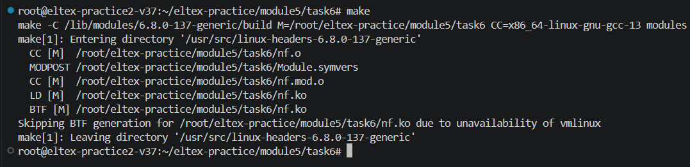
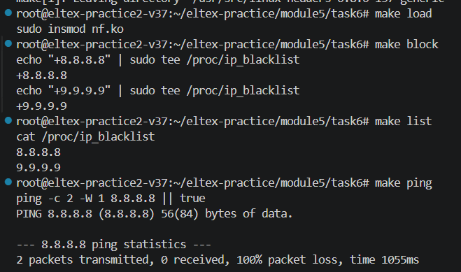
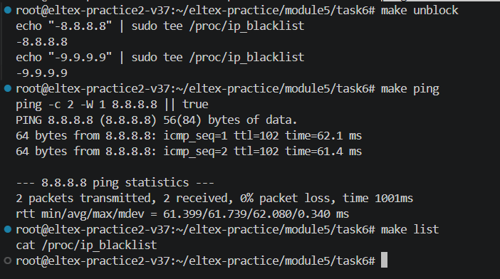

Царенкова В. А. АВТ-342

Модуль 5

Практика 6

make

Рисунок 1 – Компиляция модуля

sudo insmod nf.ko

echo "+8.8.8.8" \| sudo tee /proc/ip_blacklist

echo "+9.9.9.9" \| sudo tee /proc/ip_blacklist

cat /proc/ip_blacklist

Рисунок 2 – Проверка работы модуля

Рисунок 3 – Удаление айпи адресов из списка
